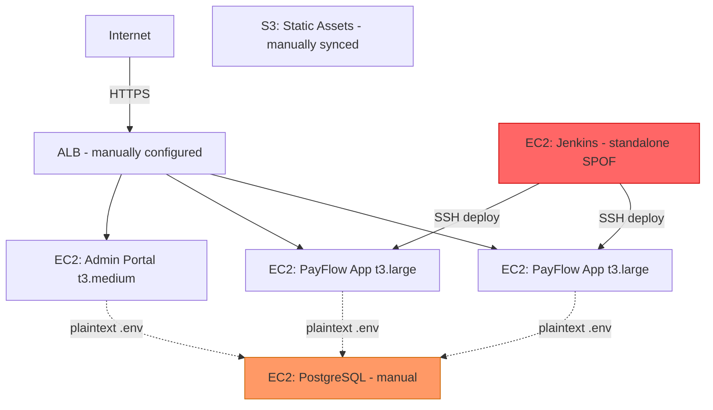

```mermaid
graph TD
    Internet -->|HTTPS| ALB[ALB - manually configured]
    ALB --> App1[EC2: PayFlow App t3.large]
    ALB --> App2[EC2: PayFlow App t3.large]
    ALB --> Admin[EC2: Admin Portal t3.medium]

    App1 -.->|plaintext .env| DB[EC2: PostgreSQL - manual]
    App2 -.->|plaintext .env| DB
    Admin -.->|plaintext .env| DB

    Jenkins[EC2: Jenkins - standalone SPOF] -->|SSH deploy| App1
    Jenkins -->|SSH deploy| App2

    S3[S3: Static Assets - manually synced]

    style Jenkins fill:#f66,stroke:#c00
    style DB fill:#f96,stroke:#c60
```

> **Note:** Red nodes = known pain points / risks.
> Jenkins was a single point of failure — no backups, crashed twice in 6 months.
> PostgreSQL was on EC2 with manual backups, not RDS.
