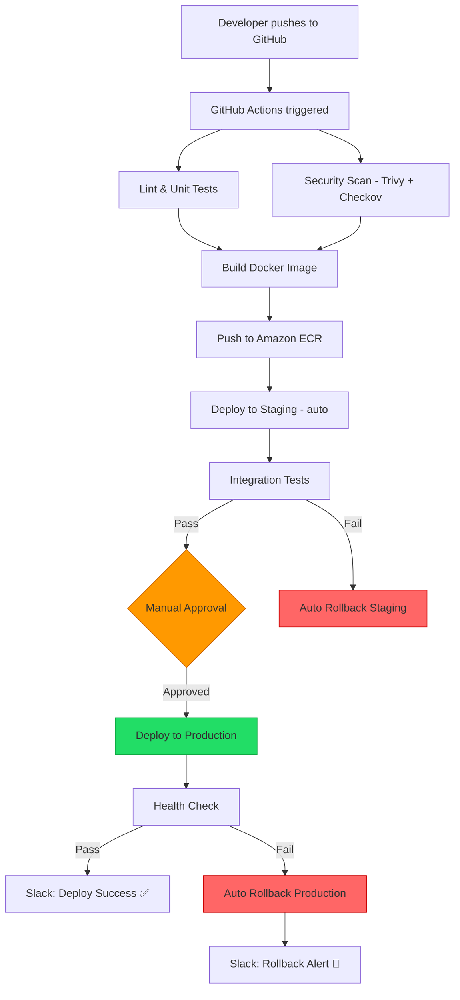

```mermaid
flowchart TD
    Push[Developer pushes to GitHub] --> GHA[GitHub Actions triggered]

    GHA --> Lint[Lint & Unit Tests]
    GHA --> Sec[Security Scan - Trivy + Checkov]

    Lint --> Build[Build Docker Image]
    Sec --> Build

    Build --> ECR[Push to Amazon ECR]
    ECR --> Staging[Deploy to Staging - auto]
    Staging --> IntTests[Integration Tests]

    IntTests -->|Pass| Gate{Manual Approval}
    IntTests -->|Fail| Rollback1[Auto Rollback Staging]

    Gate -->|Approved| Prod[Deploy to Production]
    Prod --> Health[Health Check]

    Health -->|Pass| Notify[Slack: Deploy Success ✅]
    Health -->|Fail| Rollback2[Auto Rollback Production]
    Rollback2 --> Alert[Slack: Rollback Alert 🚨]

    style Prod fill:#2d6,stroke:#1a4
    style Rollback1 fill:#f66,stroke:#c00
    style Rollback2 fill:#f66,stroke:#c00
    style Gate fill:#f90,stroke:#c60
```

> Average deploy time: **12 minutes** (was ~2 hours with Jenkins).
> Pipeline used as shared template across 12 microservice repos.
