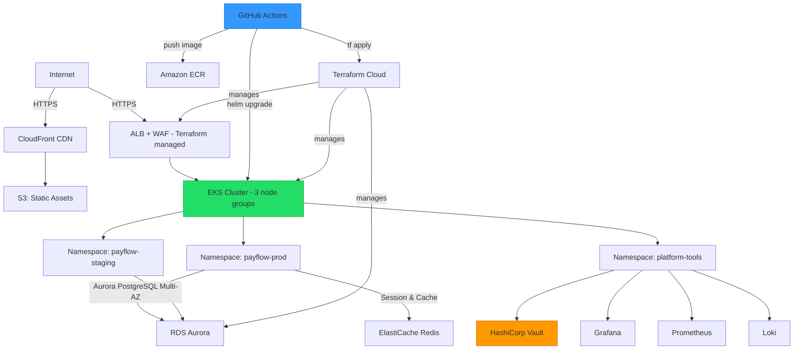

```mermaid
graph TD
    Internet -->|HTTPS| CF[CloudFront CDN]
    Internet -->|HTTPS| ALB[ALB + WAF - Terraform managed]

    CF --> S3[S3: Static Assets]
    ALB --> EKS[EKS Cluster - 3 node groups]

    EKS --> NS1[Namespace: payflow-prod]
    EKS --> NS2[Namespace: payflow-staging]
    EKS --> NS3[Namespace: platform-tools]

    NS3 --> Vault[HashiCorp Vault]
    NS3 --> Grafana[Grafana]
    NS3 --> Prometheus[Prometheus]
    NS3 --> Loki[Loki]

    NS1 -->|Aurora PostgreSQL Multi-AZ| RDS[RDS Aurora]
    NS1 -->|Session & Cache| Redis[ElastiCache Redis]
    NS2 --> RDS

    GHA[GitHub Actions] -->|push image| ECR[Amazon ECR]
    GHA -->|helm upgrade| EKS
    GHA -->|tf apply| TF[Terraform Cloud]
    TF -->|manages| ALB
    TF -->|manages| EKS
    TF -->|manages| RDS

    style EKS fill:#2d6,stroke:#1a4
    style GHA fill:#39f,stroke:#06c
    style Vault fill:#f90,stroke:#c60
```

> Entire AWS infrastructure managed as code via Terraform.
> EKS deployed via Helm charts. Secrets never stored in plaintext.
